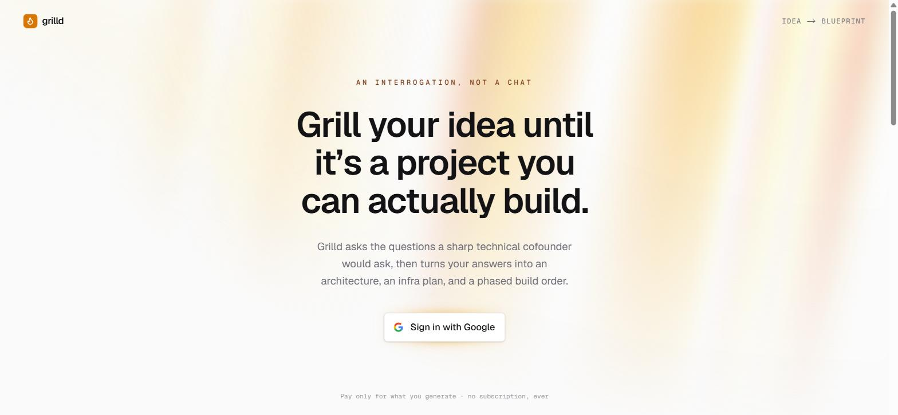
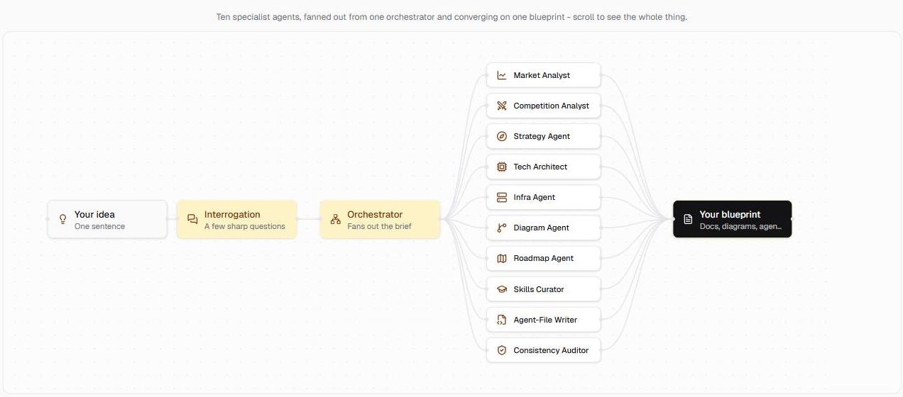

# Grilld

**Turn a raw project idea into a real starting blueprint — architecture, infra plan, phased roadmap, and a coding-agent kit, generated by a ten-agent AI pipeline.**

[](https://grilld-frontend.vercel.app)


-D97757?style=flat-square)

**[→ Try it live](https://grilld-frontend.vercel.app)** — sign in with Google, describe an idea, watch it get interrogated and turned into a blueprint in real time.

<p align="center">
  
</p>

## What it is

Most "idea → plan" tools are a single prompt wearing a UI. Grilld isn't: it's a real multi-service system where a Spring Boot backend owns every dollar and every row of state, a separate Python service runs a ten-agent LangGraph/Deep Agents pipeline for all the reasoning, and the two talk over a streamed API — the same shape a production AI product actually ships in, not a hackathon demo.

1. **Interview** — a dynamic slot-graph interrogation tracks what's known about the project and what's still missing; every question is generated fresh from context, not pulled from a script, and vague answers ("scalable", "fast") are pushed back on until they're concrete.
2. **Calibration** — a Scale Calibrator agent sizes the interview and the output to the project's real scope, so a weekend hack and a funded team's MVP get different treatment.
3. **Generation** — ten specialist agents run against the finished brief and stream live progress to the browser over Server-Sent Events, no polling spinner.
4. **Package** — everything comes back as a zip of markdown docs plus rendered Mermaid diagrams, ready to hand to a coding agent.

## The pipeline

<p align="center">
  
</p>

## Why it's more than a CRUD app

- **Real multi-agent orchestration.** Ten specialists run in a strict, resumable sequence behind one Orchestrator — not ten parallel calls to the same prompt.
- **State survives a crash.** LangGraph's Postgres checkpointer means killing the AI service mid-run and restarting it resumes exactly where it left off, agent by agent.
- **Corrections are classified, not just replayed.** A blast-radius classifier decides whether a mid-interview correction is a cheap one-fact patch or invalidates enough of the brief to need an explicit, separately-priced re-run.
- **Money is handled like money.** Credits are deducted atomically before a paid AI call is allowed to start, gated behind a cost circuit breaker — not decremented optimistically after the fact.
- **Quality is graded, not assumed.** A dedicated Rubric Agent (via LangChain's `openevals`) scores the interview brief `FAIL` / `BORDERLINE` / `PASS` before generation is allowed to run.
- **Progress is a live document, not a log.** The Run Report is a single artifact rewritten in place and pushed to the browser over SSE as each agent finishes, the same UX pattern Codex/Cursor-style tools use for long-running plans.
- **Shipped, not scaffolded.** Google OAuth login, Lemon Squeezy billing, S3 package storage, per-user rate limiting, and Dockerized deploys on Railway + Vercel are all live at the demo link above — this isn't a `docker-compose up` that only the author has run.

## Architecture

Three independently deployable services share one Postgres database, owned exclusively by the backend:

```
Browser ──HTTPS──▶ grilld-frontend  (Next.js, Vercel)
                         │  JSON + SSE
                         ▼
                   grilld-backend   (Spring Boot / Java — auth, billing,
                         │           canonical schema, orchestration API)
                         │  JSON + streaming
                         ▼
                   grilld-ai-service (Python — Deep Agents + LangGraph,
                                       all LLM/agent reasoning)
                         │
                         ▼
                   Anthropic Claude
```

| Service | Stack | Responsibility |
|---|---|---|
| [`grilld-backend`](./grilld-backend) | Java 26, Spring Boot, Postgres, Flyway | Google OAuth + JWT auth, the canonical data model, credits/billing (Lemon Squeezy), run orchestration, SSE progress, packaging |
| [`grilld-ai-service`](./grilld-ai-service) | Python, Deep Agents, LangGraph, Anthropic Claude, Tavily | The interview engine, scale calibration, and the ten-agent specialist roster |
| [`grilld-frontend`](./grilld-frontend) | Next.js 16, React 19, Tailwind | Interview UI, voice input, live run report, rendered diagrams, run history, billing |

See [`ARCHITECTURE.md`](./ARCHITECTURE.md) for the full annotated map (folder-by-folder, concept-by-concept) and [`docs/decisions-and-technical-architecture.md`](./docs/decisions-and-technical-architecture.md) for why it's split this way.

## Status

All planned backend and frontend phases are built and deployed — see [`docs/phases/`](./docs/phases) for the phase-by-phase build log (each phase folder has a `README`, `TESTING` checklist, and `SETUP` guide), and [`LEARNING.md`](./LEARNING.md) for the running engineering diary of decisions made along the way.

## Getting started locally

1. `docker compose up -d postgres` — starts the shared local Postgres instance.
2. Follow [`SETUP.md`](./SETUP.md) for every credential each service needs (Google OAuth, Anthropic, Tavily, LangSmith, Lemon Squeezy, etc.) and how to run all three services.
3. Each `docs/phases/phase-N/SETUP.md` covers the same ground incrementally, in case you want the credentials introduced one phase at a time.

## Documentation map

| Doc | Covers |
|---|---|
| [`docs/README.md`](./docs/README.md) | Product overview and doc index — start here for the *what* and *why* |
| [`docs/product-and-architecture.md`](./docs/product-and-architecture.md) | Positioning, scale calibration, agent roster, orchestration flow, MVP scope, pricing |
| [`docs/interrogation-engine.md`](./docs/interrogation-engine.md) | The dynamic slot-graph interview design |
| [`docs/decisions-and-technical-architecture.md`](./docs/decisions-and-technical-architecture.md) | Every design decision and the full technical architecture |
| [`ARCHITECTURE.md`](./ARCHITECTURE.md) | Code-level tour of the implementation, folder by folder |
| [`SETUP.md`](./SETUP.md) | Consolidated deployment credentials and local run instructions |
| [`LEARNING.md`](./LEARNING.md) | The engineering diary — bugs hit, alternatives rejected, research done |
| [`docs/phases/`](./docs/phases) | Per-phase build docs (architecture, testing gate, setup) |

## Repo layout

```
/
├── docs/                 Product spec, decisions, per-phase build docs, and README assets
├── grilld-backend/       Spring Boot (Java) — auth, billing, canonical Postgres schema, API
├── grilld-ai-service/    Python (Deep Agents + LangGraph) — all agent/LLM logic
├── grilld-frontend/      Next.js UI
├── ARCHITECTURE.md       Annotated map of the whole codebase
├── SETUP.md              Consolidated deployment credentials
├── LEARNING.md           Engineering diary
└── docker-compose.yml    Local Postgres for development
```
